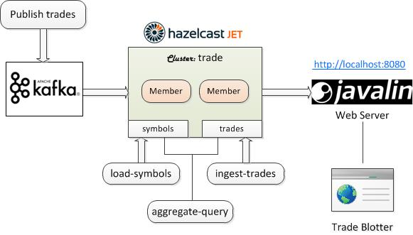

# Jet App: trade-monitor
  
The `trade-monitor` app bundle installs the `trade-monitor` demo as part of the `hazelcast/hazelcast-platform-demos` GitHub repo maintained by Hazelcast.

[https://github.com/hazelcast/hazelcast-platform-demos/tree/master/banking/trade-monitor](https://github.com/hazelcast/hazelcast-platform-demos/tree/master/banking/trade-monitor)

## Installing Bundle

```console
install_bundle -download bundle-jet-4-app-trade
```

## Use Case

This use case demonstrates Jet aggregating Kafka streamed trade data in real time. It includes a trade blotter UI for monitoring the trade aggregations executed by Jet.



## Required Software

- Java 11+
- Kafka 2.x

You must first install Kafka to run the `trade-monitor` app. To follow the steps shown in this document, you need to set the KAFKA_HOME environment variable to the Kafka installation directory. For example,

```console
export KAFKA_HOME=~/Padogrid/products/kafka_2.13-2.8.0
export PATH=$PATH:$KAFKA_HOME/bin
```

## Installing and Building the `trade` Bundle

To build it, run the `build_app` script in the `trade` app's`bin_sh` directory as follows:

```console
# Switch to the trade app
cd_app trade; cd bin_sh

# Build app
./build_app
```

The `build_app` script clones the [`hazelcast-platform-demos`](https://github.com/hazelcast/hazelcast-platform-demos/tree/master/banking/trade-monitor) repo in the `trade` app directory and builds its `banking/trade-monitor` demo.

## Running Apps

To run the demo, change directory to the demo directory as follows.

```console
cd_app trade
cd hazelcast-platform-demos/banking/trade-monitor
```

All of the demo scripts are kept in the `src/main/scripts` directory.

The `localhost-*.sh` scripts may not work for your environment if you have more than one network interfaces. Edit the scripts and assign `HOST_IP` to `localhost` or host name as shown below.

```bash
cd_app trade
cd hazelcast-platform-demos/banking/trade-monitor/src/main/scripts
vi localhost-*.sh
```

Replace the entire `HOST_IP` routine with the following in the `localhost-*.sh` files:

```bash
HOST_IP=`hostname`
```

There is a string parsing bug in `com.hazelcast.platform.demos.banking.trademonitor.ApplicationConfig.java`. To fix it, edit `localhost-hazelcast-node.sh`.

```bash
cd_app trade
cd hazelcast-platform-demos/banking/trade-monitor/src/main/scripts
vi localhost-hazelcast-node.sh
```

Add `:5701` to the end of JAVA_ARGS line in the `localhost-hazelcast-node.sh` file as follows:

```bash
JAVA_ARGS="${JAVA_ARGS} -Dhazelcast.local.publicAddress=${HOST_IP}:5701"
```

Execute the following commands in sequence. For details, see [trade-monitor repo](https://github.com/hazelcast/hazelcast-platform-demos/tree/master/banking/trade-monitor).

```bash
# 1. Start Zookeeper and Kafka
zookeeper-server-start.sh $KAFKA_HOME/config/zookeeper.properties 
kafka-server-start.sh $KAFKA_HOME/config/server.properties

# 2. Ingest data into Kafka
cd_app trade
cd hazelcast-platform-demos/banking/trade-monitor/src/main/scripts
./localhost-trade-producer.sh

# 3. Start a Jet node that submits the 'IngestTrades' and 'AggregateQuery' jobs
cd_app trade
cd hazelcast-platform-demos/banking/trade-monitor/src/main/scripts
./localhost-hazelcast-node.sh

# 4. Start web server
cd_app trade
cd hazelcast-platform-demos/banking/trade-monitor/src/main/scripts
./localhost-webapp.sh

# 5. Listen on Kafka 'kf_trades' topic
kafka-console-consumer.sh --from-beginning --bootstrap-server localhost:9092 --topic kf_trades

# 6. List jobs
jet -t grid@localhost:5701 list-jobs
```

**Trade Blotter URL:** [http://localhost:8080](http://localhost:8080)

## Tearing Down

Ctrl-C running processes in the order shown below.

   1. Kafka topic listener (5)
   2. Javalin web server (4)
   3. Jet node (3)
   4. trade-producer (2)
   5. Kafka server (1)
   6. Zookeeper (1)

## Tips

```bash
# To clear the 'kf_trades' topic, change the retention perioid to 1 sec
kafka-topics.sh --zookeeper localhost:2181 --alter --topic kf_trades --config retention.ms=1000

# Wait 1+ sec and change back the retention period (5 days)
kafka-topics.sh --zookeeper localhost:2181 --alter --topic kf_trades --config retention.ms=432000000
```
